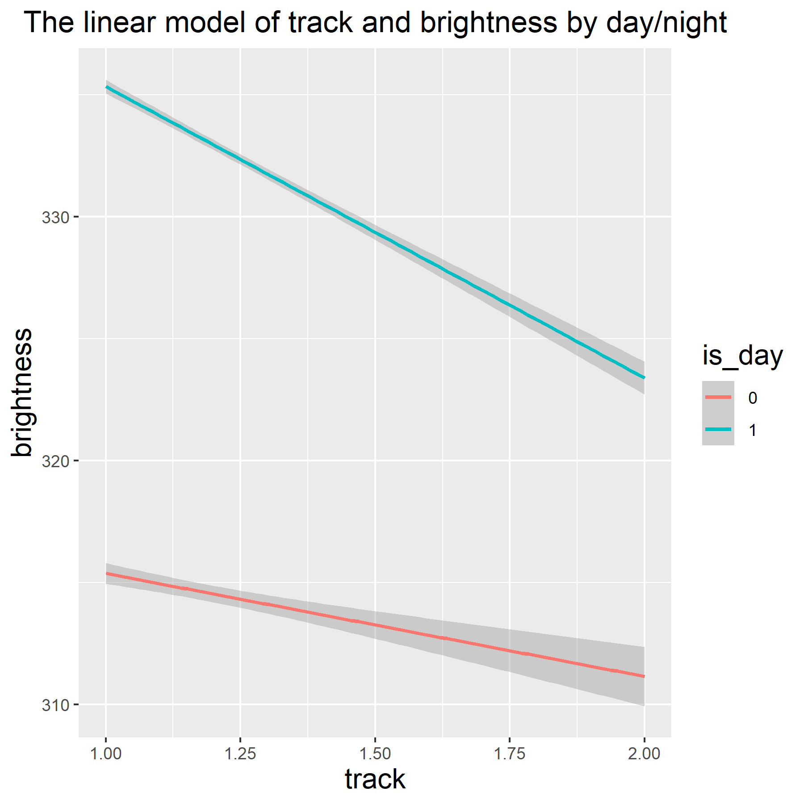
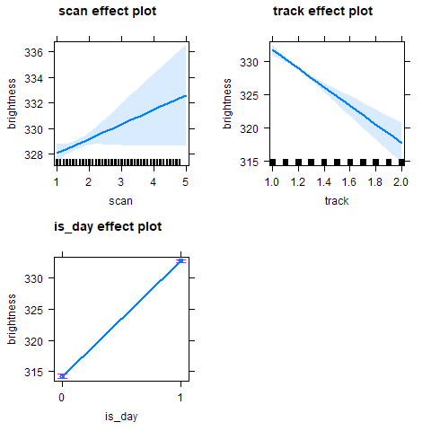

```{r setup, include=FALSE}
knitr::opts_chunk$set(echo = TRUE)
library(tidyverse)
library(broom)
```

## Introduction

The wildfire in Australia is truly a tragedy. Every possible means should be taken to prevent and properly control such a painful disaster. Thanks to the cutting-edge observatory tools from NASA, we can access [a detailed dataset](https://www.kaggle.com/carlosparadis/fires-from-space-australia-and-new-zeland) [@dataset] which provides a screenshot in the temporal development of this event. An analysis of the actual data and visualizing them can serve as a means to set up strategies for extinguishing and preventing a widespread fire like this. 

This study analyses the satellite data from NASA to understand the influence of atmospheric factors on the intensity of a fire. Fire intensity, best represented by the core temperature, is a decisive factor in an efficient extinguishing plan. [@Stephen1996] The fire can be controlled more quickly if the core temperature is lower. Therefore, it is proper to devote limited resources to the time when the fire has a lower temperature. Among the factors that can influence the fire intensity exists atmosphere, but to the best of our knowledge, no prior research has investigated the influence of atmospheric factors in the Australian 'bushfire.' For this reason, the current research will analyze atmospheric factors represented as a categorical variable of day/night in our dataset.

## Exploring the dataset
 
The [dataset](https://www.kaggle.com/carlosparadis/fires-from-space-australia-and-new-zeland) we are using [@dataset] was obtained from Kaggle, uploaded by Carlos Paradis. The raw data from observation of the wildfire by two NASA Satellite Instruments were contained in the dataset. Out of the four .csv files they provided, we are limiting our scope to 'fire_archive_M6_96619.csv' only because it is the most reliable file with raw observatory data corrected by other data sources.

In this file, each row represents an observation of fire in Australia and New Zealand. Columns are for geographic information (latitude and longitude), the fire intensity (brightness, bright_t31, frp), specifications of the observation satellite instrument (scan, track, satellite, instrument, version), quality/confidence of the observation (confidence) details on the observation time (acq_date, acq_time) and other factors (daylight).

In the next subsections, we explored the dataset with plotting Correllogram and geometric diagram

### Correllogram
From the correllogram below, we could see that there are some correlation between brightness and frp, scan and track. The color scheme in correllogram shows all positive correlations as blue, and all negative correlations as red.


```{r, out.width="50%", fig.align='center', fig.cap='Correllogram for the wildfire data', echo = FALSE, fig.pos="H"}
knitr::include_graphics('../images/correllgram.png')
```

### Geometric with longitude and latitude
From the scatter plot map below, we could get a visual concept about the overall fire locations according to brightness and rediation power. The larger point on frp means higher fire rediation power, and a lighter point color, indicates a higher brightness of the fire.

```{r, out.width="70%", fig.align='center', fig.cap='Geometric graph for the wildfire data', echo = FALSE, fig.pos="H"}
knitr::include_graphics('../images/geogram.png')
```

## Methods
As mentioned in the introduction, the objective of our research is to understand the influence of the different atmospheric conditions between day and night on the intensity of wildfire. As for the dependent variable for the intensity of a fire, there are three in the satellite observation data: 'frp', 'brightness' and 'bright_t31.' Among these variables, we select 'brightness' because there is a high correlation between 'frp' and 'brightness' and 'brightness' and 'bright_t31' as we see in the correlogram.

We ran a multiple linear regression analysis to understand whether the atmospheric difference between day and night (variable 'day/night') influences the intensity of wildfire (variable 'brightness'). We include two additional variables, 'scan' and 'track' which are expected to act randomly. These are variables that represent the specifications of the observation satellite instrument, so not necessarily related to the intensity. If the regression model with 'scan', 'track' and 'day/night' fits better than the model without 'day/night', namely including only two dummy variables, we can conclude that 'day/night' is a significant factor that decides the intensity of a fire.

```{r load_data, echo=F}
obsData <- read.csv(here::here("data","fire_archive_M6_96619.csv"), header = T)
load(here::here("data", "models.rda"))
```

Our `model` contained variable 'day/night' in addition to two dummy factors: `model <- lm(brightness ~ scan + track + daynight, data = obsData)`. The null model (`model_n`) did not: `model_n <- lm(brightness ~ scan + track, data = obsData)`. These two models were compared the anova chi-square test: `signific <- anova(model_n, model, test ="Chisq")`.

## Results

### Significance of the variable 'day/night'

Track and daynight variables in `model` were significant as shown below. 

```{r analysis_model, echo=FALSE}
tidy_model <- broom::tidy(model)
tidy_model
```

An increase in the value of 'track' lowers the temperature by `r tidy_model[3,2]`. The variable 'day/night', on the other hand disproportionally changes the temperature by `r tidy_model[4,2]`, meaning that the observed fire temperature during the daytime is higher than that during night time by `r tidy_model[4,2]`.

However, we cannot decide whether 'day/night' is significant or not by looking into this result alone. Therefore, we introduced a benchmark, namely another model `model_n`.

```{r analysis_n, echo=FALSE}
tidy_model_n <- broom::tidy(model_n)
tidy_model_n
```

As reported above, 'scan' and 'track' were only two variables that explain 'brightness' in this model and 'track' is still significant with the p-value of `r tidy_model_n[3,5]`. 

Now let us compare the model against the benchmark.

```{r compare_glance, echo=FALSE}
glance_model <- broom::glance(model) %>%
  add_column(model = "model", .before = 1)
glance_model_n <- broom::glance(model_n) %>%
  add_column(model = "benchmark model", .before = 1)

model_comp <- bind_rows(glance_model, glance_model_n)
model_comp
```

As we can see from the comparison between two models above, the adjusted coefficient of determination (adjusted R-squared) value increases from `r model_comp[2,2]` to `r model_comp[1,2]`, meaning that having another predictor 'day/night' increase the fittedness of the model.

Another support for having the 'day/night' predictor comes from the anova chi-square test.

```{r anova chi-square, echo=FALSE}
signific
```

As shown in the result reported above, the p-value for comparing the model with the 'day/night' predictor against the one without it is `r unlist(signific[5])[2]` (rounded up), which entails that this factor is highly significant in explaining the dependent variable (i.e., intensity of fire).

### Effect sizes
The two graphs presented below show the effect sizes of 'scan' and 'track'. What is important from them is the fact that the variables show significant gaps by daytime (in scarlet) and night time (in tortoise).

```{r, out.width="50%", fig.align='center', fig.cap='Scan vs. Brightness', echo = FALSE, fig.pos="H"}

```

```{r, out.width="50%", fig.align='center', fig.cap='Track vs. Brightness', echo = FALSE, fig.pos="H"}

```

Finally, the three subgraphs below show individual effect size. We can find that the effect of day/night is greater and clear (narrower whisker) than the other two variables.

```{r, out.width="50%", fig.align='center', fig.cap='Individual effect size', echo = FALSE, fig.pos="H"}

```


## Discussion and conclusion 
According to the finding described in the Results, the atmospheric differences between daytime and night have a statistically significant effect on the intensity of a fire. Assuming that the atmospheric temperature decreases after the sunset, this may influence the core temperature of a fire as well. As widely known, extinguishing the fire when the core temperature is lower is more effective and successful. Besides, the risk that personnel directly involved in the extinguishing tactics would strikingly decrease if the temperature is lower.

Our study suggests that in the limited resources, extinguishing strategy with a more active concentration in the night time can be more effective.

## References