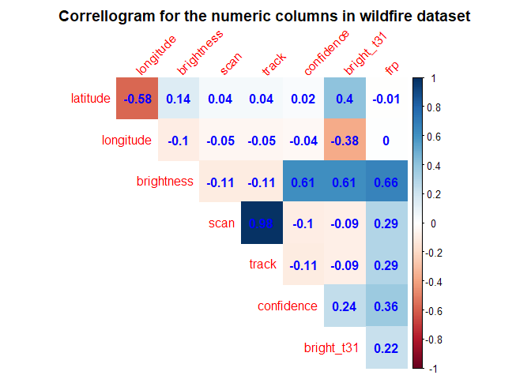
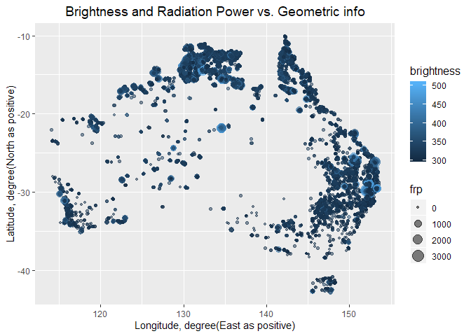

## Wildfire in Australia and New Zealand

### Introduction

The wildfire in Australia is truly a tragedy. Every possible means should be taken to prevent and properly control such a painful disaster. Thanks to the cutting-edge observatory tools from NASA, we can access to [a detailed dataset] (https://www.kaggle.com/carlosparadis/fires-from-space-australia-and-new-zeland) which provides a screenshot in the temporal development of this event. An analysis of the actual data and visualizing them can serve as a means to set up strategies for extinguishing and preventing a widespread fire like this. 

### Data description
  
The [dataset](https://www.kaggle.com/carlosparadis/fires-from-space-australia-and-new-zeland) we are using was obtained from Kaggle, uploaded by Carlos Paradis. The raw data from observation of the wildfire by two NASA Satellite Instruments were contained in the dataset. Out of the four .csv files they provided, we are limiting our scope to 'fire_archive_M6_96619.csv' only because it is the most reliable file with raw observatory data corrected by other data sources.

In this file, each row represents an observation of fire in Australia and New Zealand. Columns are for geographic information (latitude and longitude), the fire intensity (brightness, bright_t31, frp), specifications of the observation satellite instrument (scan, track, satellite, instrument, version), quality/confidence of the observation (confidence) details on the observation time (acq_date, acq_time) and other factors (daylight).

Below is the entire variable set:

<table class="table table-condensed" style="width: auto !important; margin-left: auto; margin-right: auto;">
 <thead>
  <tr>
   <th style="text-align:left;position: sticky; top:0; background-color: #FFFFFF;">  Variable           </th>
   <th style="text-align:left;position: sticky; top:0; background-color: #FFFFFF;">  Type              </th>
   <th style="text-align:left;position: sticky; top:0; background-color: #FFFFFF;">  Description                                                                                                                             </th>
  </tr>
 </thead>
<tbody>
  <tr>
   <td style="text-align:left;"> latitude </td>
   <td style="text-align:left;"> Int </td>
   <td style="text-align:left;"> The latitude value of the centre of 1km fire pixel. Not necessarily the exact location of the fire. The latitude is between -42.76 and -10.07, which covers Australia and New Zealand only. This variable will be used to represent fire on a map. </td>
  </tr>
  <tr>
   <td style="text-align:left;"> longitude </td>
   <td style="text-align:left;"> Int </td>
   <td style="text-align:left;"> The longitude value of the centre of 1km fire pixel. Not necessarily the exact location of the fire. The longitude is between 114.1 and 153.5, which covers Australia and New Zealand only. This variable will be used to represent fire on a map. </td>
  </tr>
  <tr>
   <td style="text-align:left;"> brightness </td>
   <td style="text-align:left;"> Int </td>
   <td style="text-align:left;"> Channel 21/22 brightness temperature of the fire pixel measured in Kelvin. This value represents the intensity of the fire. </td>
  </tr>
  <tr>
   <td style="text-align:left;"> scan </td>
   <td style="text-align:left;"> Int </td>
   <td style="text-align:left;"> (Along Scan pixel size) Related to the specification of the satellite observation. </td>
  </tr>
  <tr>
   <td style="text-align:left;"> track </td>
   <td style="text-align:left;"> Int </td>
   <td style="text-align:left;"> (Along Track pixel size) Related to the specification of the satellite observation. </td>
  </tr>
  <tr>
   <td style="text-align:left;"> acq_date </td>
   <td style="text-align:left;"> Date </td>
   <td style="text-align:left;"> Acquisition Date: Date of MODIS acquisition, between Aug. 1 and Sep. 30, 2019. </td>
  </tr>
  <tr>
   <td style="text-align:left;"> acq_time </td>
   <td style="text-align:left;"> String </td>
   <td style="text-align:left;"> Time of acquisition/overpass of the satellite (in UTC). </td>
  </tr>
  <tr>
   <td style="text-align:left;"> satellite </td>
   <td style="text-align:left;"> String </td>
   <td style="text-align:left;"> The name of the satellite that provided the raw observation data. Aqua and Terra in our case. </td>
  </tr>
  <tr>
   <td style="text-align:left;"> intrument </td>
   <td style="text-align:left;"> String </td>
   <td style="text-align:left;"> Constant value. MODIS only </td>
  </tr>
  <tr>
   <td style="text-align:left;"> confidence </td>
   <td style="text-align:left;"> Int (0-100) </td>
   <td style="text-align:left;"> This value is based on a collection of intermediate algorithm quantities used in the detection process. It is intended to gauge the quality of individual observation. Confidence estimates range between 0 and 100 in percentage. This variable will be used as a threshold for datapoints in actual analyses: only those observations with 90 or higher confidence values will be analyzed. </td>
  </tr>
  <tr>
   <td style="text-align:left;"> version </td>
   <td style="text-align:left;"> Int </td>
   <td style="text-align:left;"> This value identifies the collection (e.g. MODIS Collection 6) and source of data processing. 6.3 only in our case. </td>
  </tr>
  <tr>
   <td style="text-align:left;"> bright_t31 </td>
   <td style="text-align:left;"> Int </td>
   <td style="text-align:left;"> Brightness temperature 31 (Kelvin): Channel 31 brightness temperature of the fire pixel measured in Kelvin. </td>
  </tr>
  <tr>
   <td style="text-align:left;"> frp </td>
   <td style="text-align:left;"> Int </td>
   <td style="text-align:left;"> Fire Radiative Power: Depicts the pixel-integrated fire radiative power in MW (megawatts). </td>
  </tr>
  <tr>
   <td style="text-align:left;"> daynight </td>
   <td style="text-align:left;"> String (D, N) </td>
   <td style="text-align:left;"> D = Daytime, N = Nighttime </td>
  </tr>
  <tr>
   <td style="text-align:left;"> type </td>
   <td style="text-align:left;"> String </td>
   <td style="text-align:left;"> Type of observation. A specific description of the value type is unknown from the data provider. </td>
  </tr>
</tbody>
</table>


### Exploring the Dataset

#### Load the dataset

The dataset is uploaded to folder “/data” in our repository. 

```r
## Load the dataset
wildfire_data <- read_csv("../data/fire_archive_M6_96619.csv")
```

```
## Parsed with column specification:
## cols(
##   latitude = col_double(),
##   longitude = col_double(),
##   brightness = col_double(),
##   scan = col_double(),
##   track = col_double(),
##   acq_date = col_date(format = ""),
##   acq_time = col_character(),
##   satellite = col_character(),
##   instrument = col_character(),
##   confidence = col_double(),
##   version = col_double(),
##   bright_t31 = col_double(),
##   frp = col_double(),
##   daynight = col_character(),
##   type = col_double()
## )
```

```r
## Drop the non-numeric variable colums
wildfire_correlations <-
  wildfire_data %>%
    select(-acq_date, -acq_time, -satellite, -instrument, -daynight, -type, -version)
```

#### Correllogram
From the correllogram below, we could see that there are some correlation between brightness and frp, scan and track. The color scheme in correllogram shows all positive correlations as blue, and all negative correlations as red. 


```r
# Convert the numeric colums to 'double' type
wildfire_correlations[1:8] <- sapply(wildfire_correlations[1:8], as.double)
wildfire_correlations <- cor(wildfire_correlations[1:8])

wildfire_correlations <- round(wildfire_correlations,2)
corrplot(wildfire_correlations, 
         type="upper", 
         method="color", 
         tl.srt=45,
         addCoef.col = "blue",
         diag = FALSE，
         title="Correllogram for the numeric columns in wildfire dataset",
         mar=c(0,0,2,0)) 
```

<!-- -->

#### Geometric with longitue and latitude
From the scatter plot map below, we could get a visual concept about the overall fire locations according to brightness and rediation power. The larger point on frp means higher fire rediation power, and a lighter point color, indicates a higher brightness of the fire.


```r
Map_data <- wildfire_data %>%
  select(latitude, longitude, frp, brightness) 


ggplot() + 
  geom_point(data=Map_data,aes(x=longitude,y=latitude, size = frp, color=brightness), alpha = 0.5) +
  xlab ("Longitude, degree(East as positive)") +
  ylab ("Latitude, degree(North as positive)") +
  ggtitle('Brightness and Radiation Power vs. Geometric info') +
  theme(plot.title = element_text(hjust = 0.5, size = 14), legend.title = element_text(size=12))
```

<!-- -->
  

### Research Question

In this project, we will seek to determine the relationship between a factor (day/night) and the intensity (brightness/bright_t31 and frp) of the wildfire, using the logistic regression, along a timeline.

### Plan of Action

With our research question, we are only interested in the fire intensity and the day/night. We will ignore the other non-numeric variables for the purposes of this analysis. After data wrangling, we will perform a logistic regression analysis because of the nature of the factor (not numeric) and plot the relevant results. 
We will also draw a map in terms of timeline and geographic location for the brightness of the fire. 

### References

The dataset is provided by NASA Satellite instrument. The one we analysis above is MODIS C6 Archived table from [Fire from Space: Australia](https://www.kaggle.com/carlosparadis/fires-from-space-australia-and-new-zeland) in Kaggle
